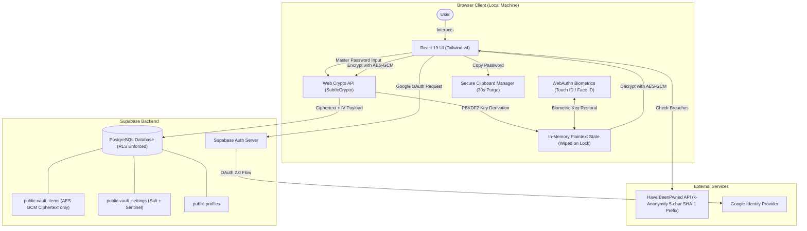

<p align="center">
  
</p>

<h1 align="center">Loxy</h1>

<p align="center">
  <strong>Zero-knowledge personal password vault with client-side AES-GCM 256 encryption and developer-first aesthetics.</strong>
</p>

<p align="center">
  <a href="https://github.com/subha-3128/Loxy"></a>
  <a href="https://github.com/subha-3128/Loxy"></a>
  <a href="https://github.com/subha-3128/Loxy"></a>
  <a href="https://github.com/subha-3128/Loxy"></a>
  <a href="https://github.com/subha-3128/Loxy"></a>
</p>

---

## Overview

**Loxy** is a secure, personal password vault designed to keep your credentials safe through strict client-side cryptography. Most traditional web vaults transmit or process authentication secrets on server-side infrastructure; Loxy eliminates this trust assumption by enforcing a **zero-knowledge architecture**.

All sensitive data—passwords, usernames, URLs, and notes—are encrypted and decrypted directly in your browser using the native Web Crypto API (`SubtleCrypto`). The backend database (Supabase PostgreSQL) only ever receives authenticated AES-GCM ciphertexts and initialization vectors. Even in the event of a full database leak or compromised server, an attacker cannot read your vault secrets without your master password.

Loxy was built for developers, security-conscious individuals, and teams who want a lightweight, modern credential manager without unnecessary bloat, subscription fees, or proprietary lock-in.

---

## Features

- **Zero-Knowledge Client-Side Encryption**
  - Cryptographic key derivation via **PBKDF2** (SHA-256, 100,000 iterations, 32-byte cryptographically secure random salt).
  - Symmetric authenticated encryption via **AES-GCM (256-bit)** with random 12-byte initialization vectors (IVs) generated per item.
  - Plaintext credentials never leave the client's local memory.

- **Independent Master Password & Verification Sentinel**
  - Master password remains strictly local and is never transmitted, stored, or hashed in the database.
  - Verification sentinel token enables client-side password verification without persisting credentials.
  - Full vault re-encryption support when changing your master password.

- **WebAuthn Biometric Quick Unlock**
  - Hardware-backed authentication (macOS Touch ID, Windows Hello, Face ID) via the WebAuthn platform authenticator.
  - Securely encrypts and restores the vault key locally for seamless re-entry without re-typing long master passwords.

- **Breached Password Scanner (HaveIBeenPwned k-Anonymity)**
  - Audits vault passwords against billions of compromised credentials exposed in public data leaks.
  - Implements mathematical **k-Anonymity**: only the first 5 characters of the SHA-1 password hash are sent over the network; zero passwords or full hashes are ever exposed.

- **30-Second Auto-Clearing Clipboard**
  - One-click copy for usernames and passwords.
  - Passwords automatically wipe from the operating system clipboard after 30 seconds to prevent background clipboard snooping.

- **CSV Password Importer**
  - Seamless migration from **Google Chrome**, **Bitwarden**, **1Password**, and **LastPass**.
  - Client-side CSV parsing, validation, batch AES-GCM encryption, and direct synchronization to the vault.

- **Cryptographically Secure Password Generator**
  - Uses `crypto.getRandomValues()` to eliminate pseudo-random bias.
  - Configurable length (12–32 characters) and character sets (uppercase, lowercase, numbers, symbols).
  - Real-time entropy evaluation and visual strength scoring (Weak, Fair, Strong, Very Strong).

- **Security Health Dashboard**
  - Live client-side audit of your vault security posture.
  - Tracks weak passwords, reused credentials across accounts, and known data breaches.
  - Quick-action shortcuts to update vulnerable credentials directly.

- **Configurable Inactivity Auto-Lock**
  - Automatically wipes decrypted secrets and derived keys from memory after a specified inactivity duration (5, 15, 30 minutes, or Never).
  - Instant manual `Lock Vault` button available in navigation.

- **Search & Favorites**
  - Instant client-side search across websites, usernames, and URLs with keyboard shortcut (`⌘K` / `Ctrl+K`).
  - Star favorite accounts for pinned, fast access.

- **Encrypted JSON Vault Backup**
  - Export full zero-knowledge encrypted JSON vault backups (containing salts, verification tokens, and encrypted items) for offline archiving.

- **Progressive Web App (PWA) & Offline Shell**
  - Installable as a standalone native app on macOS, Windows, iOS, and Android.
  - Custom Service Worker precaches the cryptographic application shell for instant offline loading anywhere.
  - Zero sensitive database credentials or API calls are ever stored in unencrypted Service Worker caches.

- **Offline Developer Sandbox Fallback**
  - If Supabase environment variables are omitted, Loxy seamlessly boots in local encrypted storage mode for testing.

---

## Tech Stack

| Category | Technology | Description |
| :--- | :--- | :--- |
| **Frontend Framework** | [React 19](https://react.dev/) | Component-based UI library |
| **Build Tool & Bundler** | [Vite 8](https://vite.dev/) | Next-generation frontend tooling with Rolldown manual chunk splitting |
| **Language** | [TypeScript 6](https://www.typescriptlang.org/) | Strongly typed JavaScript |
| **Styling** | [Tailwind CSS v4](https://tailwindcss.com/) | Modern utility-first CSS framework |
| **Cryptography** | [Web Crypto API](https://developer.mozilla.org/en-US/docs/Web/API/Web_Crypto_API) | Native browser cryptographic primitives (`SubtleCrypto`: PBKDF2, AES-GCM, SHA-1, SHA-256) |
| **Authentication** | [Supabase Auth](https://supabase.com/docs/guides/auth) & [WebAuthn](https://w3c.github.io/webauthn/) | Google OAuth 2.0 and platform biometric authentication |
| **Database** | [PostgreSQL (Supabase)](https://supabase.com/docs/guides/database) | Cloud-hosted relational database with Row Level Security (RLS) |
| **Icons** | [Lucide React](https://lucide.dev/) | Clean, customizable SVG icon system |
| **Breach Intelligence** | [HaveIBeenPwned API](https://haveibeenpwned.com/API/v3#PwnedPasswords) | Range search k-Anonymity password breach auditing |
| **Test Runner** | [Vitest 5](https://vitest.dev/) | Vite-native unit testing framework |
| **Linter** | [Oxlint](https://oxc.rs/) | High-performance Rust-based JavaScript/TypeScript linter |

---

## Project Architecture



### Data Flow

1. **Authentication**: The user logs in via Google OAuth. The Supabase Auth token identifies the session and enforces Postgres Row Level Security (`auth.uid() = user_id`).
2. **Key Derivation**: The user supplies their master password. Loxy fetches their 32-byte salt from `vault_settings`, executes 100,000 PBKDF2 iterations with SHA-256 via Web Crypto, and produces an exportable 256-bit AES-GCM key.
3. **Master Password Verification**: The derived key decrypts the sentinel string stored in `verification_data`. If it matches `LOXY_VAULT_KEY_VALID_V1`, the vault is unlocked.
4. **Item Decryption**: Encrypted items are fetched from `vault_items`. Each item is decrypted locally using its unique 12-byte initialization vector (IV) and the derived AES key. Decrypted records exist solely in React component state.
5. **Item Creation & Modification**: When adding or updating an item, plaintext data is serialized into JSON, encrypted with AES-GCM, and bundled into `{ ciphertext, iv }`. Only this ciphertext payload is transmitted to Supabase.
6. **Vault Locking**: On timeout or user lock, the derived key and in-memory plaintext state are set to `null`, completely clearing sensitive material from memory.

---

## Project Structure

```text
Loxy/
├── public/                       # Static public assets (favicons, manifest icons)
│   ├── favicon.svg
│   └── icons.svg
├── src/
│   ├── assets/                   # Bundled UI assets
│   │   ├── hero.png
│   │   ├── react.svg
│   │   └── vite.svg
│   ├── components/               # React UI components
│   │   ├── auth/
│   │   │   └── LoginView.tsx     # Google OAuth login interface
│   │   ├── layout/
│   │   │   ├── Navbar.tsx        # Top bar with search (⌘K), lock indicator, and profile
│   │   │   ├── Sidebar.tsx       # Primary navigation (All, Favorites, Security, Settings)
│   │   │   └── MobileNav.tsx     # Responsive bottom navigation bar
│   │   ├── password/
│   │   │   ├── PasswordCard.tsx          # Credential card with 30s copy & favorite toggle
│   │   │   ├── PasswordModal.tsx         # Add/Edit credential form with password generator
│   │   │   ├── PasswordDetailsModal.tsx  # Detailed credential view
│   │   │   └── DeleteConfirmModal.tsx    # Deletion safety modal
│   │   ├── security/
│   │   │   └── SecurityDashboard.tsx     # Health score, breach scanner, and weak password audit
│   │   ├── settings/
│   │   │   └── SettingsView.tsx          # Master password change, biometrics, CSV import, export
│   │   ├── ui/
│   │   │   ├── Modal.tsx                 # Base accessible modal wrapper
│   │   │   └── Toast.tsx                 # Ephemeral notification context and toasts
│   │   └── vault/
│   │       └── VaultUnlockModal.tsx      # Master password unlock & biometric prompt
│   ├── contexts/                 # Global state management
│   │   ├── AuthContext.tsx       # Supabase session and user state
│   │   └── VaultContext.tsx      # Vault lifecycle, cryptographic state, and item mutations
│   ├── lib/                      # Core business logic & cryptographic primitives
│   │   ├── biometrics.ts         # WebAuthn platform authenticator integration
│   │   ├── breachCheck.ts        # HaveIBeenPwned k-Anonymity breach detection
│   │   ├── breachCheck.test.ts   # Vitest suite for breach detection
│   │   ├── clipboard.ts          # Ephemeral 30-second auto-clearing clipboard
│   │   ├── crypto.ts             # PBKDF2 key derivation and AES-GCM 256 encryption
│   │   ├── crypto.test.ts        # Vitest suite for cryptographic primitives
│   │   ├── csvImporter.ts        # Bitwarden, Chrome, and 1Password CSV parser
│   │   ├── csvImporter.test.ts   # Vitest suite for CSV parsing
│   │   ├── passwordGenerator.ts  # Web Crypto random generator & entropy scoring
│   │   ├── passwordGenerator.test.ts # Vitest suite for password generator
│   │   └── supabase.ts           # Supabase client instantiation & database access layer
│   ├── types/
│   │   └── vault.ts              # TypeScript interfaces for vault items, crypto, and auth
│   ├── utils/
│   │   └── supabase/
│   │       └── client.ts         # SSR-ready browser Supabase client utility
│   ├── App.tsx                   # Main root view router and layout coordinator
│   ├── index.css                 # Tailwind CSS v4 directives and custom scrollbars
│   └── main.tsx                  # Application bootstrap entry point
├── supabase/
│   └── schema.sql                # PostgreSQL tables, RLS policies, indexes, and triggers
├── .env.example                  # Environment variable configuration template
├── package.json                  # Dependencies, devDependencies, and npm scripts
├── tsconfig.json                 # TypeScript compiler configuration
└── vite.config.ts                # Vite config with Tailwind v4 & Rolldown chunk splitting
```

---

## Prerequisites

Before running Loxy, verify that your environment meets the following requirements:

- **Node.js**: `v18.0.0` or higher (Node `v20+` or `v22+` recommended; Web Crypto API is native).
- **Package Manager**: `npm` (v9+ or v10+), `pnpm`, or `yarn`.
- **Supabase Account**: A Supabase project with PostgreSQL and Supabase Auth enabled.
- **Google Cloud Console Account**: For configuring Google OAuth 2.0 credentials in Supabase.

---

## Installation

1. **Clone the repository**:

   ```bash
   git clone https://github.com/subha-3128/Loxy.git
   cd Loxy
   ```

2. **Install project dependencies**:

   ```bash
   npm install
   ```

---

## Environment Variables

Copy the template file `.env.example` to `.env.local` (or `.env`):

```bash
cp .env.example .env.local
```

Populate the variables with your Supabase credentials:

| Variable | Description | Required | Example |
| :--- | :--- | :---: | :--- |
| `VITE_SUPABASE_URL` | Your Supabase project URL | **Yes** | `https://xyzproject.supabase.co` |
| `VITE_SUPABASE_ANON_KEY` | Your Supabase project public/anon API key | **Yes** | `sb_publishable_...` |

*(Note: `NEXT_PUBLIC_SUPABASE_URL` and `NEXT_PUBLIC_SUPABASE_PUBLISHABLE_KEY` are also accepted for Next.js-compatible environments via `envPrefix` in `vite.config.ts`.)*

```env
# Example .env.local
VITE_SUPABASE_URL=https://your-project-id.supabase.co
VITE_SUPABASE_ANON_KEY=your-supabase-anon-key
```

> **Fallback Mode**: If Loxy is launched without valid Supabase credentials, it automatically operates in **Local Encrypted Sandbox Mode**, saving AES-GCM encrypted records in local storage for demonstration and offline testing.

---

## Running the Project

### Development

Start the local Vite development server with Hot Module Replacement (HMR):

```bash
npm run dev
```

Open [http://localhost:5173](http://localhost:5173) in your browser.

### Production Build

Compile TypeScript and generate an optimized static production bundle:

```bash
npm run build
```

The production output is generated in the `dist/` directory.

### Production Preview

Preview the production build locally:

```bash
npm run preview
```

### Running Tests

Execute the unit test suite via Vitest:

```bash
npm test
```

### Linting

Run Oxlint to check code quality and static analysis:

```bash
npm run lint
```

---

## Database

Loxy utilizes **PostgreSQL** hosted on Supabase. All database tables strictly enforce **Row Level Security (RLS)**, ensuring that authenticated users can only query, modify, or delete their own data.

### Schema Setup

To initialize your database, copy the contents of [`supabase/schema.sql`](./supabase/schema.sql) and execute it in your Supabase project's **SQL Editor**:

### Tables and Structure

#### 1. `public.profiles`
Stores basic public user profile information populated upon signup.

| Column | Type | Description |
| :--- | :--- | :--- |
| `id` | `UUID PRIMARY KEY` | References `auth.users.id` (ON DELETE CASCADE) |
| `email` | `TEXT NOT NULL` | User email address |
| `display_name` | `TEXT` | User full name or email username fallback |
| `avatar_url` | `TEXT` | Profile picture URL from OAuth provider |
| `created_at` | `TIMESTAMPTZ` | Timestamp of account creation |

*RLS: Authenticated users can only `SELECT`, `INSERT`, and `UPDATE` their own row (`auth.uid() = id`).*

#### 2. `public.vault_items`
Stores the encrypted vault items. Sensitive credentials are never stored in plaintext columns.

| Column | Type | Description |
| :--- | :--- | :--- |
| `id` | `UUID PRIMARY KEY` | Unique identifier generated via `gen_random_uuid()` |
| `user_id` | `UUID NOT NULL` | References `auth.users.id` (ON DELETE CASCADE) |
| `encrypted_data` | `TEXT NOT NULL` | Stringified JSON `{ ciphertext: string, iv: string }` |
| `category` | `TEXT NOT NULL` | Category tag (default `'Other'`) |
| `is_favorite` | `BOOLEAN NOT NULL` | Pinned favorite flag (default `false`) |
| `created_at` | `TIMESTAMPTZ` | Creation timestamp |
| `updated_at` | `TIMESTAMPTZ` | Last modification timestamp |

*RLS: Full access restricted exclusively to the owning user (`auth.uid() = user_id`).*

#### 3. `public.vault_settings`
Stores cryptographic configuration parameters required to derive keys and verify master passwords.

| Column | Type | Description |
| :--- | :--- | :--- |
| `user_id` | `UUID PRIMARY KEY` | References `auth.users.id` (ON DELETE CASCADE) |
| `salt` | `TEXT NOT NULL` | Base64-encoded 32-byte PBKDF2 salt |
| `verification_data` | `TEXT NOT NULL` | Ciphertext of known sentinel token encrypted with master key |
| `auto_lock_minutes`| `INTEGER` | User-preferred inactivity timeout (default `15`) |
| `created_at` | `TIMESTAMPTZ` | Setup timestamp |
| `updated_at` | `TIMESTAMPTZ` | Last settings update timestamp |

*RLS: Full access restricted exclusively to the owning user (`auth.uid() = user_id`).*

#### 4. Automatic User Provisioning Trigger
A PostgreSQL trigger function `public.handle_new_user()` is attached to `auth.users` to automatically populate `public.profiles` on first OAuth sign-in.

---

## Authentication

Loxy provides a multi-stage authentication and authorization flow:

1. **Identity Authentication (Google OAuth)**:
   - Handled through Supabase Auth using the Google provider.
   - Upon successful sign-in, an access session token is stored securely in browser storage.
2. **Vault Encryption Setup (First Login)**:
   - The user creates their master password.
   - The client generates a random 32-byte salt using `crypto.getRandomValues()`.
   - PBKDF2 derives the AES key, encrypts the sentinel token `LOXY_VAULT_KEY_VALID_V1`, and commits the salt and ciphertext to `vault_settings`.
3. **Vault Unlock (Subsequent Logins)**:
   - The user enters their master password.
   - The client derives the key with the user's existing salt and attempts to decrypt the sentinel token.
   - If decryption succeeds and matches the sentinel, the key is loaded into in-memory state.
4. **Biometric Authentication (Touch ID / Face ID)**:
   - Users can register a WebAuthn platform authenticator credential.
   - The master key is encrypted locally using the biometric credential, allowing one-touch unlocking on supported hardware.
5. **Auto-Lock Lifecycle**:
   - User activity events (`mousemove`, `keydown`, `click`) update an in-memory activity timestamp.
   - When the configured auto-lock threshold elapses with no activity, the derived key is discarded and the unlock modal is displayed.

---

## API & External Integrations

Loxy is a client-side single-page application that connects to two external API surfaces:

### 1. Supabase Client API

| Scope | Method / Query | Description |
| :--- | :--- | :--- |
| **Auth** | `supabase.auth.signInWithOAuth({ provider: 'google' })` | Initiates Google OAuth authentication |
| **Auth** | `supabase.auth.getSession()` | Retrieves current active user session |
| **Auth** | `supabase.auth.signOut()` | Terminates current session |
| **Database** | `supabase.from('vault_settings').select('*')` | Retrieves salt and verification sentinel |
| **Database** | `supabase.from('vault_settings').upsert(...)` | Stores initial or updated vault settings |
| **Database** | `supabase.from('vault_items').select('*')` | Fetches encrypted credentials for user |
| **Database** | `supabase.from('vault_items').insert(...)` | Saves new encrypted credential |
| **Database** | `supabase.from('vault_items').update(...)` | Updates existing encrypted credential |
| **Database** | `supabase.from('vault_items').delete(...)` | Removes vault item by ID |

### 2. HaveIBeenPwned Range API (k-Anonymity)

| Method | Endpoint | Description | Privacy Model |
| :--- | :--- | :--- | :--- |
| `GET` | `https://api.pwnedpasswords.com/range/{5_char_sha1_prefix}` | Fetches list of hash suffixes matching prefix | **Zero password disclosure**: Only first 5 characters of SHA-1 hash are sent. Suffix matching is calculated locally in browser. |

---

## Usage

### 1. First-Time Setup
1. Open the application at [http://localhost:5173](http://localhost:5173).
2. Click **Continue with Google** to complete OAuth sign-in.
3. In the setup modal, define a strong **Master Password** and choose whether to enable **Touch ID / Biometric unlock**.
4. Click **Create & Secure Vault**.

### 2. Adding and Managing Passwords
1. Click **Add Password** from the sidebar or top navigation.
2. Enter the website name, username/email, and password.
3. Use the built-in **Password Generator** to create high-entropy passwords with custom length and character sets.
4. Select a category (*Development, Work, Social, Banking, Shopping, College, Entertainment, Other*) and optional notes.
5. Click **Save Encrypted Password**.

### 3. Importing Passwords via CSV
1. Navigate to **Settings** > **Import Passwords (CSV)**.
2. Click **Select CSV File to Import**.
3. Select an exported CSV from Chrome, Bitwarden, 1Password, or LastPass.
4. Loxy validates the columns, encrypts each credential client-side with AES-GCM 256, and stores them in your vault.

### 4. Running Security Health Audits
1. Open the **Security Health** tab from the sidebar.
2. Review weak and reused passwords identified by the entropy analyzer.
3. Click **Scan Known Breaches** to audit your credentials against the HaveIBeenPwned database via k-Anonymity.
4. Click **Change** next to any compromised credential to update it immediately.

### 5. Locking and Unlocking the Vault
- Click **Lock Vault** in the sidebar at any time to wipe the key from memory.
- Unlock using your master password or the **Unlock with Touch ID / Biometrics** button.

---

## Deployment

Loxy builds as a fully static Single Page Application (SPA) in the `dist/` directory and can be deployed to any modern static hosting provider (e.g., **Vercel**, **Netlify**, **Cloudflare Pages**, or **GitHub Pages**).

### Deployment Steps (e.g., Vercel / Netlify)

1. Connect your GitHub repository to your hosting provider.
2. Configure build settings:
   - **Framework Preset**: `Vite`
   - **Build Command**: `npm run build`
   - **Output Directory**: `dist`
3. Configure Environment Variables in the hosting dashboard:
   - `VITE_SUPABASE_URL`: `https://your-project.supabase.co`
   - `VITE_SUPABASE_ANON_KEY`: `your-supabase-anon-key`
4. **Update Supabase Redirect URLs**:
   - In your Supabase Dashboard, navigate to **Authentication** > **URL Configuration**.
   - Add your production domain (e.g., `https://your-app.vercel.app`) to **Redirect URLs**.

---

## Available Scripts

The following scripts are defined in `package.json`:

| Command | Description |
| :--- | :--- |
| `npm run dev` | Starts the Vite development server with Hot Module Replacement on `http://localhost:5173` |
| `npm run build` | Runs TypeScript compilation (`tsc -b`) and bundles static assets for production (`vite build`) |
| `npm run preview` | Starts a local web server to preview the generated production build (`dist/`) |
| `npm test` | Runs the full Vitest automated unit test suite across cryptography, breach check, and CSV modules |
| `npm run lint` | Runs the high-performance Oxlint linter to detect code smells and syntax issues |

---

## Troubleshooting

### 1. `Unsupported provider: provider is not enabled`
- **Cause**: Google OAuth is not enabled in your Supabase project.
- **Fix**: In the Supabase Dashboard, go to **Authentication** > **Providers** > **Google**, toggle it **ON**, and enter your Google Client ID and Client Secret from Google Cloud Console.

### 2. Redirect Loop or OAuth Callback Failure
- **Cause**: The current application URL is not registered in Supabase authorized redirect URLs.
- **Fix**: Add `http://localhost:5173` (for development) and your production URL to **Authentication** > **URL Configuration** > **Redirect URLs** in Supabase.

### 3. Forgot Master Password
- **Cause**: Zero-knowledge design principle.
- **Resolution**: Because Loxy does not store or escrow your master password anywhere, **it is impossible to recover or decrypt your vault without your master password**. Keep a secure offline backup of your master password.

### 4. Touch ID / Biometrics Not Showing or Failing
- **Cause**: WebAuthn requires a secure origin (`https://` or `localhost`) and hardware authenticator support.
- **Fix**: Ensure you are running on `localhost` or HTTPS, and that your browser has permission to access system biometric features.

### 5. HaveIBeenPwned Scan Offline / Network Failure
- **Cause**: Network block or firewall preventing connections to `api.pwnedpasswords.com`.
- **Behavior**: Loxy handles network errors gracefully and will skip unreachable items without crashing or reporting false positives.

---

## Security

- **Strict Zero-Knowledge**: No plaintext passwords, usernames, URLs, or notes are ever transmitted over the network or persisted to any server.
- **Cryptographic Isolation**: Each vault item uses a distinct, cryptographically random 12-byte initialization vector (`crypto.getRandomValues()`).
- **Sentinel Token Verification**: Master password validity is confirmed via authenticated decryption of a sentinel token, eliminating the need to store password hashes in the database.
- **k-Anonymity Breach Auditing**: Only the first 5 characters of SHA-1 hashes are sent to HaveIBeenPwned. The remaining hash matching occurs exclusively in the local browser.
- **Ephemeral Clipboard Storage**: Passwords copied to the system clipboard are purged automatically after 30 seconds.
- **Environment Protection**: Never commit `.env` or `.env.local` files to version control. The repository `.gitignore` is configured to exclude local environment files.

---

## Contributing

Contributions are welcome. Please adhere to the following workflow:

1. Fork the repository.
2. Create a feature branch:
   ```bash
   git checkout -b feature/your-feature-name
   ```
3. Make your modifications.
4. Verify code quality and test coverage:
   ```bash
   npm test
   npm run lint
   npm run build
   ```
5. Commit your changes with a clear, descriptive message:
   ```bash
   git commit -m "feat: add feature description"
   ```
6. Push to your branch and submit a Pull Request.

---

## License

> No license has currently been specified.

---

## Author

- **Subhajit Bepari** ([sb3128@srmist.edu.in](mailto:sb3128@srmist.edu.in))
- GitHub Repository: [https://github.com/subha-3128/Loxy.git](https://github.com/subha-3128/Loxy.git)
